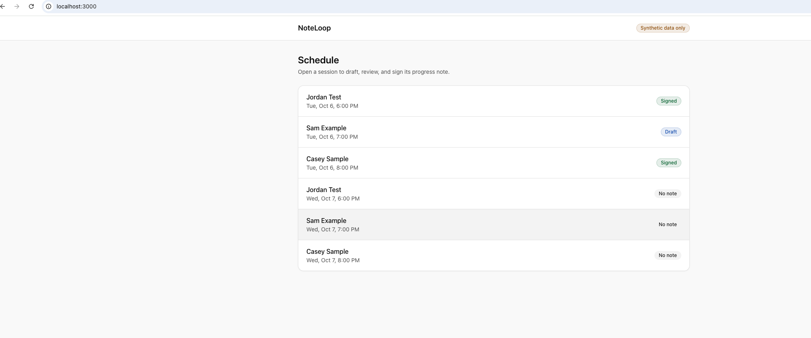
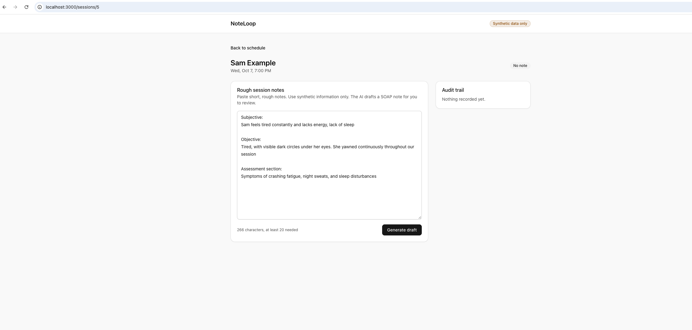
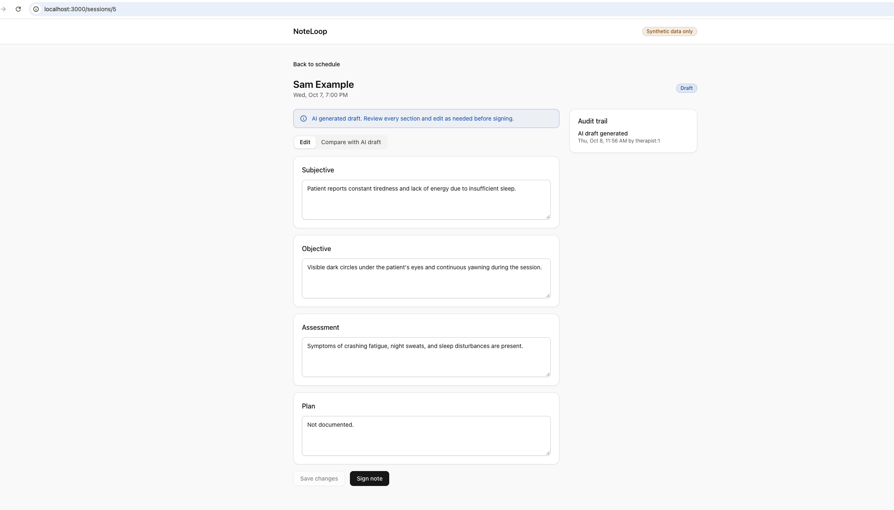
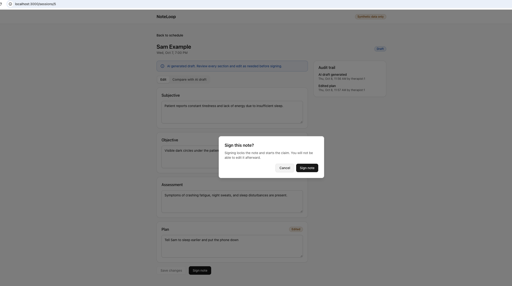
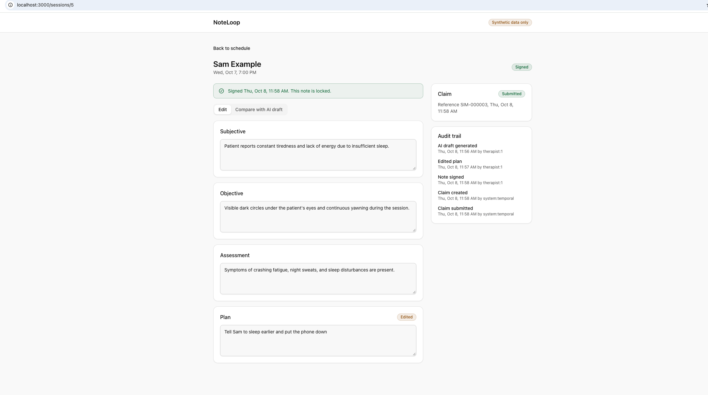
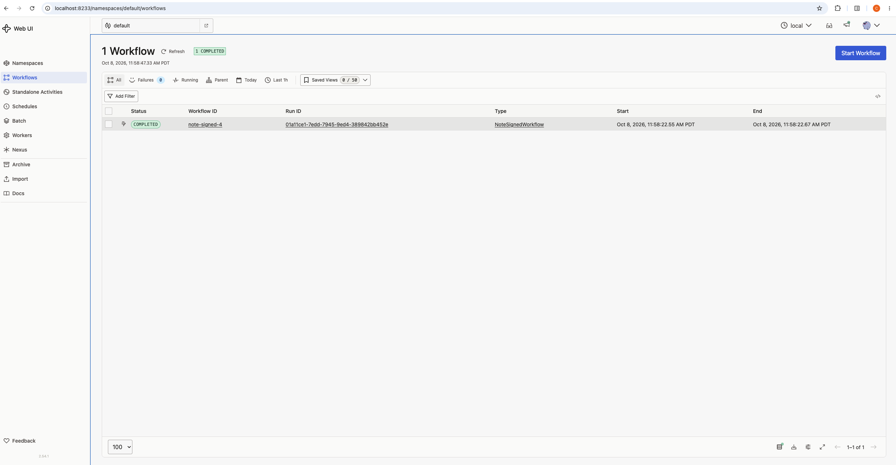
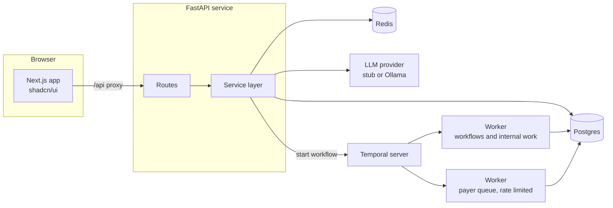
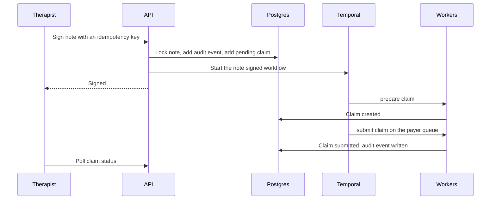

# NoteLoop

An AI assisted progress note tool for therapists. The AI drafts a SOAP note from rough session notes, the therapist edits it, asks for better wording where needed, and signs it. Signing starts a durable background workflow that creates and submits an insurance claim.

## What it does

1. A therapist opens a session from the schedule and pastes rough notes.
2. The API asks an LLM for a SOAP note (Subjective, Objective, Assessment, Plan) and validates the reply against a schema before saving it.
3. The therapist edits any section. A section reduced to short phrases can be sent back for a more formal rewrite. The suggestion appears as a diff, and nothing changes until the therapist accepts it.
4. A compare view shows the AI draft against the final text, word by word.
5. Signing locks the note, writes an audit event, and starts a Temporal workflow that creates a claim and submits it to a simulated payer, with retries.
6. A batch workflow can resubmit every failed claim in chunks, at a controlled rate.

## Screenshots

Click any image to open it full size.
<table>
  <tr>
    <td></td>
    <td></td>
    <td></td>
  </tr>
  <tr>
    <td></td>
    <td></td>
    <td></td>
  </tr>
</table>

## System design

What happens when a note is signed:

## Tech stack

* Frontend: Next.js, React, TypeScript, Tailwind, shadcn/ui
* Backend: Python 3, FastAPI, SQLAlchemy, Pydantic
* Storage: Postgres, Redis
* Workflows: Temporal with the Python SDK
* AI: an LLM behind a provider interface, with a deterministic stub for tests and local runs
* Local setup: Docker Compose

## Why I built this

Therapists spend a large share of their week on documentation. A progress note has to be structured and accurate, and the clinician who ran the session has to sign it. An LLM can write a first draft in seconds, but in healthcare a draft that nobody reviews is a liability.

I wanted to build the smallest realistic version of an AI feature that gives clinicians time back and keeps them responsible for the record. The model call is the easy part. Most of the work is the system around it: validation, review, an audit trail, and a way to see what clinicians change.

I also wanted to build the whole stack myself, with the schema at one end and the browser screen at the other, plus a background job behind it. My day job is in claims and payments, so the part after signing is modeled on that world: a claim that can fail and be retried, and failed claims that can be resubmitted in bulk.

## Design decisions

### The human always signs

The AI never writes a final note. A note is a draft until a therapist signs it, and only the signed text moves downstream. The cost is an extra step. I accepted it because the clinician is accountable for the record.

### AI suggestions are proposals

The model suggests wording and shows it as a diff. Nothing is applied or saved until the therapist clicks Accept, and editing a section throws away its stale suggestion. The prompt tells the model to use only facts in that section's own text. Saving records which sections came from an accepted suggestion, so the audit trail can tell AI assisted edits from manual ones.

### Draft and final text are stored separately

The `ai_draft` column is written once, and a database level check refuses later changes to it. The therapist edits `final_note`. Keeping both makes the AI versus human diff possible and gives a direct measure of draft quality: how much did people have to change?

### Structured output at the LLM boundary

The model must return JSON that matches a schema. Invalid output is retried once, then rejected with a 502, and nothing is saved. Free text from a model never reaches the database unchecked.

### A provider interface with a stub

Both LLM calls (draft and suggest) sit behind one small interface. The stub returns deterministic output and marks its rewrites as stub output, so tests are repeatable and the app runs with no API key. Switching to a real model is one environment variable.

### Temporal for the claim workflow

Signing starts a multi step process that can fail partway, such as a payer timeout. Temporal provides durable state, retries with backoff, and a history of every attempt. Activities are idempotent because Temporal can run them more than once. Workflow IDs are derived from the note, so signing twice cannot start two workflows.

I have used Celery with RabbitMQ in production, and it would work for a single background job. I chose Temporal because this flow has dependent steps and failure handling that I would otherwise write by hand. The cost is more concepts (determinism rules, activities versus workflows) and one more service to run.

### The claim row is written with the signature

The pending claim is created in the same database transaction as the signature. If Temporal is down when a note is signed, the signature still succeeds and the claim stays visibly pending, instead of the follow up work disappearing.

### Batch resubmit with child workflows

Resubmitting failed claims is one parent workflow that pages through failed claims by id, starts one child workflow per claim for each chunk, and waits for the chunk to finish. Each claim fails and retries on its own. The cursor moves forward, so a claim that fails again is not picked up twice in the same batch. After several chunks the parent restarts itself with a fresh history (`continue_as_new`), which keeps a very large batch from growing one workflow's history without limit. The batch has a fixed workflow ID, so only one can run at a time.

### Rate limiting by queue

Every call to the payer runs on its own task queue, served by a separate worker with a queue wide rate limit. That puts the limit in one place. It applies the same way to a single signed note and to a batch of thousands, no matter how many workers run.

### Redis for cost control, and it fails open

Redis rate limits the draft and suggestion endpoints per therapist and stores idempotency keys for signing, so a double click returns the first result. If Redis is down, requests go through, and the database still blocks a double sign with a 409. These limits protect LLM spend, which is not worth blocking a clinician over.

## Responsible AI and PHI

* This is a portfolio project. It is not a medical device and has not been clinically validated.
* All patient data is synthetic. Do not enter real patient information.
* Drafts are labeled as AI generated until a therapist signs.
* A production version would need a business associate agreement with the LLM vendor, encryption at rest and in transit, role based access control, retention rules, and a security review.

## Future improvements

1. Evaluation: a set of synthetic sessions that checks drafts for missing sections and invented details, with edit distance against hand corrected references, run as a rate limited batch workflow.
2. A review pass before signing that flags empty or vague sections and statements that do not appear in the original notes.
3. Feed accepted and rejected suggestions back to the model as examples.
4. Authentication, role based access control, and Postgres row level security.
5. Alembic migrations, and a Temporal setup with persistent storage.
6. Real claim generation and status tracking, with a payer acknowledgment signal and a timeout that moves a claim to manual review.
7. A UI for the batch resubmit with live progress.
8. Errors and tracing through Sentry and Datadog, including LLM latency and cost.
9. Streaming drafts to the browser.
10. More note formats (DAP, BIRP) and treatment plans.
